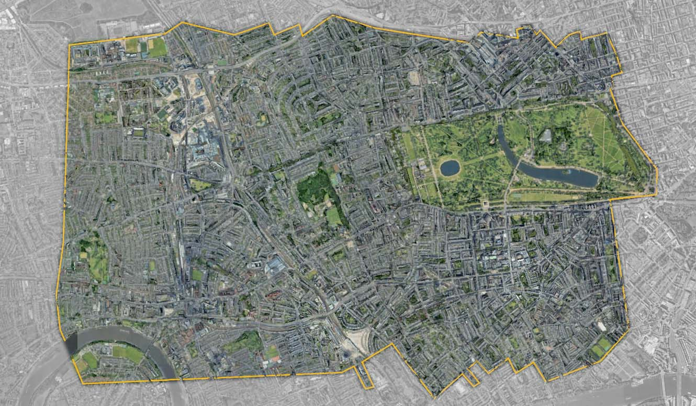

# City-Scale Atmospheric Boundary Layer modelling using NN4PDEs

This repository presents a novel approach to the discretisation and solution of the Navier-Stokes Equations using finite difference (FD), finite volume (FV), and finite element methods (FE). This method reformulates the discretised system of equations as a discrete convolution, analogous to a convolutional layer in a neural network, and solves it using a V-cycle geometric multigrid.

## Key Features:
- **Platform-Agnostic Code**: Runs seamlessly on CPUs, GPUs, and AI-optimized processors.
- **Neural Network Integration**: Easily integrates with trained neural networks for sub-grid-scale models, surrogate models, or physics-informed approaches.
- **Accelerated Development**: Leverages machine-learning libraries to speed up model development.

## Applications:
- Incompressible Navier-Stokes Equations are modelled using NN4PDEs to simulate the flow of air over an urban area
- It is a scalable method which has been run in serial on CPU and GPU
- It has been run in parallel on 2,4, and 8 GPUs in a local machine as well as a GPU cluster

### Domain of the problem
- The domain is the South Kensington area in London which covers 5 km by 4 km
- The resolution in this case is 1 m in x, y and z directions

## Result

## Contact and references
For more information please get in touch with me via:
- Email: amin.nadimy19@imperial.ac.uk
